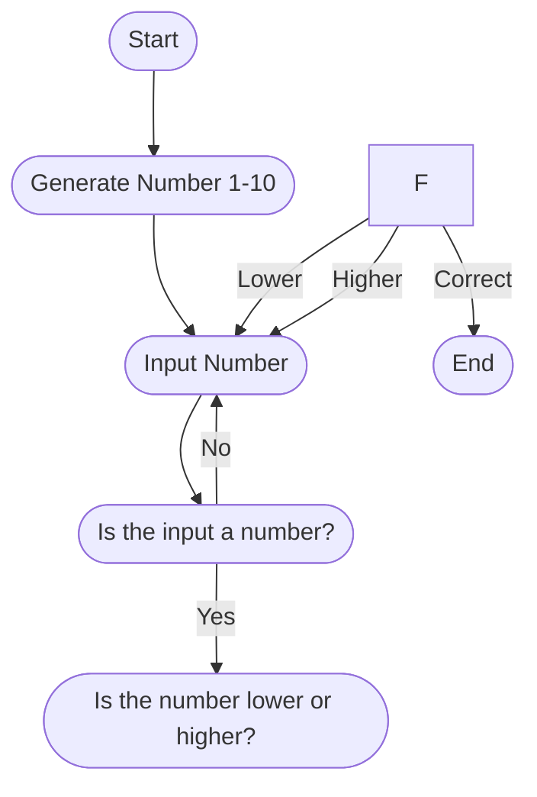

## Number Guessing Game

## Instructions for game
1. Computer Generates Number
2. Human inputs number
3. If the number is not a number, it stays stagnant at number input
4. If it is higher or lower than the correct number, it goes back to asking for a new input
5. If the input is correct, the game ends
